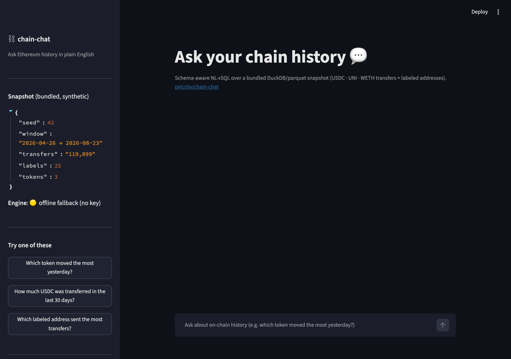
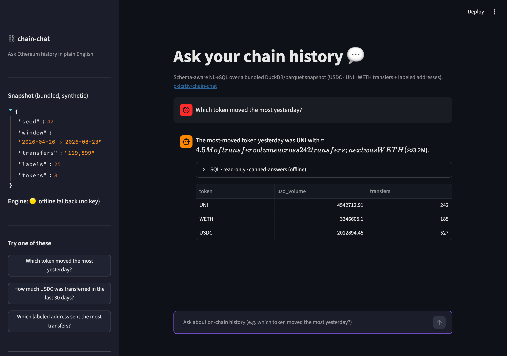
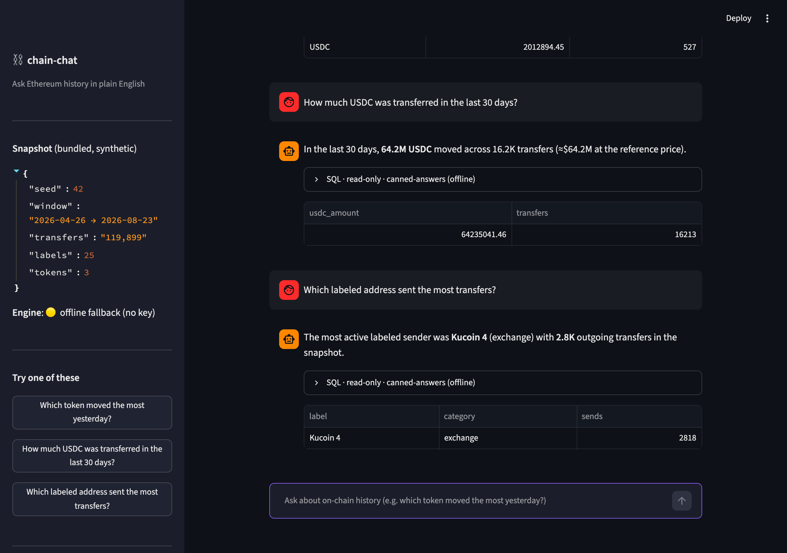

<div align="center">

# ⛓️ chain-chat

**Ask on-chain history in plain English.**

"*Which token moved the most yesterday?*" — a schema-aware LLM turns your
question into SQL over a bundled DuckDB/parquet snapshot of Ethereum token
transfers. **No paid APIs. No API key required. Runs fully offline.**

[](https://www.python.org/)
[](LICENSE)
[](https://duckdb.org/)
[](https://streamlit.io/)
[](https://parquet.apache.org/)
[](https://github.com/pxlcrtiv/chain-chat/actions)
[](https://github.com/pxlcrtiv/chain-chat/actions/workflows/ci.yml)
[](https://github.com/pxlcrtiv/chain-chat)
[](https://github.com/pxlcrtiv/chain-chat)

</div>

---

## The problem

On-chain data lives in explorers, dashboards and warehouses. Asking a
question like *"which token moved the most yesterday?"* means fighting with
SQL, token decimals, address labels and a schema nobody remembers — or paying
for an analytics API.

## The solution

chain-chat bundles a small, reproducible Ethereum transfer snapshot
(USDC / UNI / WETH transfers + labeled addresses + token metadata, ~8 MB of
parquet + one compiled DuckDB database) and lets you ask questions about it
in English. A schema-aware prompt teaches any OpenAI-compatible LLM the
schema, its output is validated by SQL guardrails (read-only, LIMIT, timeout),
executed, and the results summarized back to you.

And when you have **no LLM key at all** — the demo still works: three
canonical questions are answered deterministically with real numbers computed
offline.

## Features

| Feature | Where |
|---|---|
| 🗄️ Bundled deterministic snapshot (transfers + labels + tokens) | `scripts/fetch_parquet.py` · `chain_chat/snapshot.py` |
| 🔒 Read-only DuckDB query layer (parameter binding, forced LIMIT, timeout+interrupt) | `chain_chat/db.py` |
| 🛡️ SQL guardrails (SELECT/WITH only, no stacked statements, no file access) | `chain_chat/guardrails.py` |
| 🤖 NL→SQL with schema-aware prompt + execute-and-validate rewrite loop | `chain_chat/nl2sql.py` |
| 🧮 Deterministic zero-key fallback answering the 3 canonical questions | `chain_chat/canned.py` |
| ✅ 7 golden regression queries | `chain_chat/golden.py` |
| 💬 Streamlit chat UI with canned-question shortcuts | `app.py` |
| 🌱 Daily Green automation (one dated commit per day) | `scripts/daily_update.py` + `scripts/tips_pool.json` |
| 🔁 Valid CI workflow (runners currently blocked by account billing lock — verified locally) | `.github/workflows/ci.yml` |

## Quickstart — real demo, zero keys, ≤ 2 minutes

```bash
git clone https://github.com/pxlcrtiv/chain-chat.git
cd chain-chat
python3.12 -m venv .venv && source .venv/bin/activate
pip install -r requirements.txt
streamlit run app.py        # fully offline — no OPENAI_API_KEY needed
```

The snapshot is already bundled in `data/snapshot/`. The home screen:



Ask the flagship question — answered in seconds, offline:



A full conversation (USDC 30-day volume, most active labeled sender):



> Screenshots are real output from `streamlit run app.py` with **no API key** —
> the yellow *offline fallback* badge in the sidebar is the point.

### Adding an LLM (optional, any OpenAI-compatible endpoint)

```bash
export OPENAI_API_KEY=sk-...                      # required
export OPENAI_BASE_URL=https://api.openai.com/v1  # optional — works with
export CHAIN_CHAT_MODEL=gpt-4o-mini               #  local/self-hosted too
streamlit run app.py
```

With a key, *any* question works (not just the three canned ones): the LLM
proposes SQL, it is guardrail-checked, executed, and errors are fed back for
automatic rewrites — up to 2 retries per question.

## How it works

```
you ──question──▶ schema-aware prompt (tables, columns, notes, few-shots)
                        │  OpenAI-compatible LLM  (optional)
                        ▼
                   {"sql": "SELECT ..."}        ◀── error text fed back
                        │  guardrails: SELECT/WITH only · no ';' · LIMIT
                        ▼
              read-only DuckDB (chainchat.db)   ◀── timeout + interrupt
                        │
                        ▼
              rows ──▶ summarization pass ──▶ plain-English answer + SQL table
```

Without a key, the pipeline short-circuits to `chain_chat/canned.py` — the
three canonical questions are answered by real SQL against the snapshot, so
the demo, tests and CI are all keyless.

**The three canned questions:**

| Question | SQL sketch |
|---|---|
| Which token moved the most yesterday? | top token by `SUM(amount × usd_reference_price)` on `max(ts) − 1 day` |
| How much USDC was transferred in the last 30 days? | trailing-30-day `SUM(amount)` for `token = 'usdc'` |
| Which labeled address sent the most transfers? | `COUNT(*)` grouped by sender, joined to the label registry |

## Honest caveats

- **The snapshot is synthetic.** It is seeded, reproducible data in the
  *shape* of real Ethereum flows (lognormal transfer sizes, busy-day
  clustering, recognizable label categories) — generated offline by
  `scripts/fetch_parquet.py`. It is a demo dataset, not mainnet history.
- **No real funds, ever.** Testnet-only data policy: the bundled data is
  synthetic and the optional live connector reads public data only.
- **Reference prices are static.** `tokens.usd_reference_price` is a fixed
  synthetic number so cross-token comparisons are possible; it is not a
  market feed.
- **LLM output is best-effort.** Guardrails stop injection and runaway
  queries, but a model can still write a *wrong-but-valid* query. Check the
  SQL expander; golden queries pin the canonical answers.
- **GitHub Actions runners are currently blocked** by the account's billing
  lock (jobs register but never start). The CI workflow is valid and verified
  locally — CI badges will light up once the lock is lifted.
- **Live BigQuery mode is a documented contract, not a bundled feature.**
  `scripts/fetch_parquet.py --live` fails fast with instructions until you
  provide a GCP credential (`GOOGLE_APPLICATION_CREDENTIALS` /
  `GCP_SERVICE_ACCOUNT_JSON` / `BIGQUERY_KEY`) — see `chain_chat/live.py`.

## Tech stack

| Layer | Choice | Why |
|---|---|---|
| Language | Python 3.11 / 3.12 | ubiquitous, readable, great data ecosystem |
| Storage | DuckDB 1.x + parquet | single-file read-only engine; vectorized; zero ops |
| Data files | pandas → parquet, seeded RNG | reproducible, diffable, ~8 MB snapshot |
| Chat UI | Streamlit | chat input + dataframes + expanders in ~150 lines |
| LLM client | `requests` → OpenAI-compatible `/chat/completions` | works with OpenAI, LM Studio, llama.cpp, vLLM… |
| Guardrails | token-level SQL scanner | injection/statement/file-access denylists |
| Tests | pytest (65 tests) | golden queries, injection guards, mock LLM, timeout |
| CI | GitHub Actions (ci.yml + daily.yml) | unit tests + snapshot determinism + offline smoke |

## Reproduce everything

```bash
python scripts/fetch_parquet.py                 # regenerate the snapshot
python scripts/fetch_parquet.py --seed 7 --days 30 --per-day 200
python -m pytest tests/ -q                      # 65 tests, all offline
python -m pytest tests/test_golden_and_snapshot.py -q   # golden + determinism
```

## Daily Green automation

One meaningful, dated commit per day keeps the contribution graph honest.
`scripts/daily_update.py` appends a curated on-chain data/analytics tip
(rotated deterministically from `scripts/tips_pool.json` — 24 tips) to
`docs/daily-tips.md`, then commits and pushes with the day's date. It is
idempotent, backfills missed days, and never creates empty commits.

- **Scheduler (primary):** macOS launchd job `com.pxlcrtiv.daily-green`
  runs the wrapper `~/portfolio/scripts/daily-green.sh`, which auto-discovers
  every repo under `~/portfolio/repos/` — no per-repo configuration needed.
- **Cloud fallback:** `.github/workflows/daily.yml` runs the same script on a
  schedule (currently gated by the Actions billing lock, like all CI here).
- **Pause / customize:** `touch .daily-pause` in the repo root, or add
  entries to `scripts/tips_pool.json`. Test with
  `DAILY_GREEN_SIM_DATE=2026-08-23 DAILY_GREEN_NO_PUSH=1 python scripts/daily_update.py`.

## Data policy

- **Testnet-only / synthetic-only.** No real mainnet funds anywhere in this
  repo. The bundled snapshot is explicitly synthetic and regenerable.
- **No paid APIs.** The demo runs with zero keys; the optional LLM path
  works with any OpenAI-compatible endpoint, local or hosted.
- **Read-only at the engine level.** `chainchat.db` is opened with
  `read_only=True`; the guardrail scanner is defense in depth, not the only
  defense.

## Project family

| Repo | What it is |
|---|---|
| [model-ledger](https://github.com/pxlcrtiv/model-ledger) | Solidity registry + Foundry tests + Sepolia deploy scripts |
| [slither-chat](https://github.com/pxlcrtiv/slither-chat) | Smart-contract audit copilot: Slither + offline finding explanations |
| **chain-chat** | **You are here** — ask on-chain history in plain English |
| agent-lab | Agent tooling lab (cross-linked portfolio) |

## License & docs

- [MIT License](LICENSE)
- [Contributing](CONTRIBUTING.md)
- [Changelog](CHANGELOG.md)

<div align="center">

Built by [pxlcrtiv](https://github.com/pxlcrtiv) — synthetic data, honest
caveats, no paid APIs. 🌱

</div>